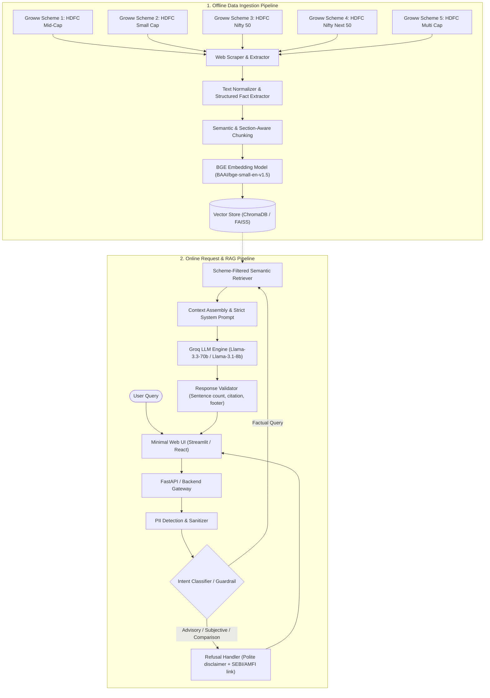
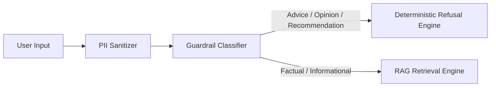

# Mutual Fund FAQ Assistant - System Architecture Document

## 1. System Overview & Architectural Principles

The **Mutual Fund FAQ Assistant** is a specialized, compliance-first, facts-only Retrieval-Augmented Generation (RAG) system. Designed around the Groww product context, the assistant answers objective, factual queries strictly for 5 designated HDFC Mutual Fund schemes.

### Core Architectural Principles
1. **Accuracy Over Intelligence:** The system prioritizes strict factual precision and grounding over conversational creativity or speculative reasoning.
2. **Zero-Advice Guardrails (Compliance by Design):** Queries requesting financial advice, opinions, subjective recommendations, or comparisons are intercepted and refused deterministically.
3. **Deterministic Response Contract:** Every response is capped at **3 sentences**, includes **exactly 1 citation link** to the source Groww URL, and contains a mandatory **"Last updated from sources: <date>"** footer.
4. **Zero-PII Privacy Guarantee:** Strict pre-processing filters strip any accidental Personally Identifiable Information (PAN, Aadhaar, folio numbers, contact details) before processing.

---

## 2. High-Level Architecture Diagram



---

## 3. Detailed Component Architecture

### 3.1. Data Ingestion & Indexing Pipeline (Offline / Periodic)

The data pipeline extracts, normalizes, and embeds factual mutual fund data exclusively from the 5 designated Groww scheme pages:

| Scheme Name | Category | Source URL |
| :--- | :--- | :--- |
| **HDFC Mid-Cap Opportunities Fund** | Mid Cap | `https://groww.in/mutual-funds/hdfc-mid-cap-fund-direct-growth` |
| **HDFC Small Cap Fund** | Small Cap | `https://groww.in/mutual-funds/hdfc-small-cap-fund-direct-growth` |
| **HDFC Nifty 50 Index Fund** | Large Cap Index | `https://groww.in/mutual-funds/hdfc-nifty-50-index-fund-direct-growth` |
| **HDFC Nifty Next 50 Index Fund** | Next 50 Index | `https://groww.in/mutual-funds/hdfc-nifty-next-50-index-fund-direct-growth` |
| **HDFC Multi Cap Fund** | Multi Cap | `https://groww.in/mutual-funds/hdfc-multi-cap-fund-direct-growth` |

#### Pipeline Steps:
1. **Extraction & Scraping (`scraper.py`):**
   - Fetches HTML / DOM content from the 5 Groww URLs.
   - Extracts structured key-value attributes (Expense Ratio, Exit Load, Stamp Duty, Min SIP / Lump sum, AUM, NAV, Benchmark, Riskometer, Fund Manager, Lock-in period).
   - Extracts textual sections (Fund overview, investment objective, tax implications, redemption rules).
2. **Chunking Strategy (`chunker.py`):**
   - **Structured Fact Records:** Each core fund attribute is indexed as an atomic factual chunk with rich metadata (`scheme_name`, `category`, `attribute_type`, `source_url`, `last_scraped_at`).
   - **Semantic Text Chunks:** Overlapping chunks (chunk size: 250–400 tokens, overlap: 50 tokens) for descriptive FAQ topics (e.g., taxation rules, exit load holding rules)3. **Embedding & Storage (`indexer.py`):**
   - Embeds chunks using the **BAAI/bge-small-en-v1.5** (or `bge-base-en-v1.5`) dense embedding model via `sentence-transformers` or `FastEmbed`.
   - Stores vectors and metadata in **ChromaDB** / **FAISS** with metadata filtering capabilities on `scheme_name`.

---

### 3.2. Input Guardrails & Query Routing

Before invoking the vector database or LLM, every user query passes through dual-stage input validation:



1. **PII Sanitizer:**
   - Detects and masks regex patterns for PAN (`[A-Z]{5}[0-9]{4}[A-Z]`), Aadhaar (`\d{4}\s\d{4}\s\d{4}`), bank account numbers, phone numbers, and emails.
   - If sensitive financial credentials are sent, the system halts processing and instructs the user not to share PII.
2. **Intent & Advisory Classification (`guardrail.py`):**
   - Classifies query into:
     - **`FACTUAL`**: Scheme parameters, definitions, ratios, official procedures. $\rightarrow$ Route to RAG.
     - **`ADVISORY`**: *"Should I buy?"*, *"Is this fund good for 3 years?"*, *"Suggest a fund for high return"*. $\rightarrow$ Route to Refusal.
     - **`COMPARATIVE_OPINION`**: *"Which fund is better: Small Cap or Mid Cap?"*. $\rightarrow$ Route to Refusal.
     - **`OUT_OF_CORPUS`**: Questions unrelated to the 5 HDFC schemes or mutual funds. $\rightarrow$ Route to Refusal / Out-of-Scope.

---

### 3.3. Deterministic Refusal Engine

When an advisory or opinionated query is detected, the system does not generate an ungrounded LLM reply. Instead, it generates a standard refusal complying with SEBI guidelines:

- **Refusal Tone:** Polite, objective, and transparent.
- **Content:** Reasserts that the assistant provides factual information only and does not provide investment advice.
- **Resource Link:** Cites SEBI Investor Education (`https://investor.sebi.gov.in/`) or AMFI (`https://www.amfiindia.com/`).

---

### 3.4. Semantic Retriever & Context Assembly

1. **Scheme Recognition:** Identifies target scheme(s) from query entities (e.g., *"HDFC Small Cap expense ratio"* $\rightarrow$ filter metadata: `scheme_name = 'HDFC Small Cap Fund'`).
2. **Dense BGE Retrieval:**
   - Queries vector store using BGE query embeddings with top-$k$ ($k = 3–5$) semantic similarity matches.
   - Re-ranks or filters strictly by the active scheme context.
3. **Context Construction:**
   - Bundles retrieved text snippets with exact `source_url` and `last_updated_date`.

---

### 3.5. Groq LLM Prompt Architecture & Constraints

The **Groq API** (`llama-3.3-70b-versatile` or `llama-3.1-8b-instant`) is prompted with strict instruction-following rules designed to prevent hallucination, deliver ultra-low latency, and enforce output constraints:

```text
SYSTEM PROMPT:
You are the Mutual Fund FAQ Assistant for Groww. Your sole responsibility is to answer factual, verifiable questions strictly using the provided context for 5 HDFC Mutual Fund schemes.

STRICT CONSTRAINTS:
1. Grounding: Answer ONLY using the facts in the provided CONTEXT. If the context does not contain the answer, state that the information is unavailable in the official scheme documents.
2. No Financial Advice: Never recommend, rate, compare fund quality, or advise whether to invest.
3. Sentence Limit: Your entire answer MUST NOT exceed 3 sentences.
4. Citation: Provide EXACTLY ONE clickable citation link to the corresponding Groww scheme URL at the end of the answer.
5. Footer: Always append the exact footer on a new line:
   "Last updated from sources: <date>"
```

---

### 3.6. Output Validator & Post-Processor (`validator.py`)

Every generated response is inspected prior to delivery to the client:
- **Sentence Counter:** Verifies sentence count $\le 3$. (Trims or regenerates if violated).
- **Citation Validator:** Validates that exactly one valid URL from the approved 5 Groww URLs is present.
- **Footer Check:** Confirms the presence of `"Last updated from sources: <date>"`.
- **Compliance Check:** Regex scan to ensure no advisory trigger words (e.g., *"I recommend"*, *"You should invest"*, *"Best choice"*) leaked through.

---

## 4. User Interface Architecture (Minimalist Web App)

```
+-----------------------------------------------------------------------+
|  🌱 Groww Mutual Fund FAQ Assistant                                   |
|  [Disclaimer: Facts-only. No investment advice.]                      |
+-----------------------------------------------------------------------+
|  👋 Welcome! Ask any factual query about the 5 selected HDFC schemes. |
|                                                                       |
|  Suggested Questions:                                                 |
|  [💰 What is the expense ratio of HDFC Small Cap Fund?]               |
|  [⏳ What is the exit load for HDFC Mid-Cap Opportunities Fund?]       |
|  [📈 What is the benchmark index of HDFC Multi Cap Fund?]             |
|                                                                       |
|  Chat History:                                                        |
|  User: What is the exit load of HDFC Small Cap Fund?                  |
|  Assistant:                                                           |
|  For HDFC Small Cap Fund, an exit load of 1% is applicable if units  |
|  are redeemed within 1 year from the date of allotment. No exit load  |
|  is charged for redemptions after 1 year.                             |
|  Source: https://groww.in/mutual-funds/hdfc-small-cap-fund-direct-growth |
|  Last updated from sources: 2026-08-23                               |
+-----------------------------------------------------------------------+
|  [ Type your question here...                               ] [Send]  |
+-----------------------------------------------------------------------+
```

### UI Requirements:
- **Disclaimer Banner:** Prominently visible at all times (`"Facts-only. No investment advice."`).
- **Example Query Chips:** Clickable starter prompts for seamless testing.
- **Single-Turn / Context-Aware Chat Interface:** Clean typography, source badges, and formatted citations.

---

## 5. Technology Stack

| Layer | Recommended Technology | Rationale |
| :--- | :--- | :--- |
| **Frontend** | Streamlit or React + Vite | Clean, rapid deployment, minimal footprint. |
| **Backend API** | FastAPI (Python 3.10+) | High performance, async support, type validation. |
| **RAG Framework** | LangChain / LlamaIndex / Custom | Lightweight orchestration of retrieval and prompt templates. |
| **Vector Store** | ChromaDB (Local / In-memory) | Zero external server dependency, fast persistent vector storage. |
| **Embeddings** | **BAAI/bge-small-en-v1.5** (`sentence-transformers` / `FastEmbed`) | State-of-the-art open-source retrieval benchmark performance, local execution. |
| **LLM Inference** | **Groq API** (`llama-3.3-70b-versatile` / `llama-3.1-8b-instant`) | Ultra-fast token generation, low latency, strict prompt adherence. |
| **Scraping / Parsing**| BeautifulSoup4 / Requests / Playwright | Structured HTML table and text extraction from Groww URLs. |from Groww URLs. |

---

## 6. Directory Structure

```
MutualFundFAQAssistant/
│
├── Docs/
│   └── problemStatement.txt         # Original project problem statement
├── context.md                       # Project requirements & corpus context
├── architecture.md                  # Detailed system architecture document
├── README.md                        # Setup, scheme list, and operational guide
│
├── data/
│   ├── raw/                         # Scraped raw HTML/JSON from the 5 Groww URLs
│   ├── processed/                   # Cleaned, structured scheme facts JSON
│   └── chromadb/                    # Persistent vector database store
│
├── src/
│   ├── __init__.py
│   ├── config.py                    # App configuration, URLs, constants
│   ├── ingestion/
│   │   ├── scraper.py               # Data extractor for the 5 Groww scheme pages
│   │   ├── parser.py                # Fact parser and normalizer
│   │   └── indexer.py               # Chunking, embedding, vector DB loader
│   ├── core/
│   │   ├── guardrail.py             # PII filter & advisory intent classifier
│   │   ├── retriever.py             # Semantic vector retriever with metadata filter
│   │   ├── generator.py             # LLM prompt orchestration & RAG generator
│   │   └── validator.py             # Sentence counter, citation & footer validator
│   └── api/
│       └── app.py                   # FastAPI backend endpoints
│
├── ui/
│   └── app.py                       # Streamlit / Web UI application
│
├── tests/
│   ├── test_guardrails.py           # Unit tests for advisory refusal & PII
│   ├── test_retrieval.py            # Retrieval accuracy & grounding tests
│   └── test_validator.py            # Output format compliance tests
│
└── requirements.txt                 # Project dependencies
```

---

## 7. Security, Compliance & Failure Modes

### 7.1. Failure Modes & Mitigation Strategies

| Failure Mode | Risk | Mitigation Strategy |
| :--- | :--- | :--- |
| **Advisory Leakage** | User tricks model into giving investment advice. | Dual guardrail: Pre-retrieval intent classifier + Post-generation regex validator. |
| **Hallucination** | Model invents numbers (e.g. wrong expense ratio). | Strict grounding prompt; low temperature ($T = 0.0$); atomic structured fact retrieval. |
| **Format Violation** | Response exceeds 3 sentences or lacks citation. | Deterministic `validator.py` trims sentences and verifies citation format before sending. |
| **PII Submission** | User enters PAN or folio number. | Client-side and server-side regex sanitization intercepts and drops PII immediately. |
| **Out-of-Scope Query** | User asks about non-HDFC funds or general trivia. | Model fallback responds with facts-only disclaimer and refers to the 5 supported schemes. |

---

## 8. Summary of Success Metrics

1. **Grounding Accuracy:** 100% of facts match the scraped Groww scheme parameters.
2. **Compliance Adherence:** 0% investment advice or subjective comparisons delivered.
3. **Format Adherence:** 100% of outputs have $\le 3$ sentences, 1 citation link, and valid timestamp footer.
4. **Latency:** End-to-end response time under 1.5 seconds.
