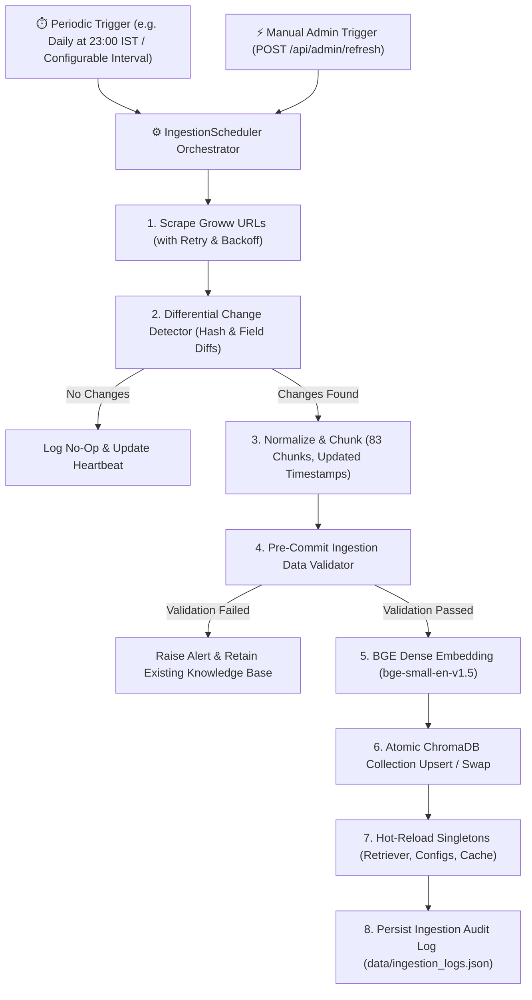

# Implementation Plan: Mutual Fund FAQ Assistant (Facts-Only RAG)

Build a compliance-first, facts-only RAG assistant for 5 HDFC Mutual Fund schemes using Groww as reference data source, strictly adhering to the requirements in [context.md](file:///c:/Users/SIDHARTH%20PANTULA/Downloads/MutualFundFAQAssistant/context.md) and [architecture.md](file:///c:/Users/SIDHARTH%20PANTULA/Downloads/MutualFundFAQAssistant/architecture.md).

---

## User Review Required

> [!IMPORTANT]
> **Key Architecture & Model Specifications:**
> 1. **LLM Engine:** **Groq Cloud API** (`llama-3.3-70b-versatile` / `llama-3.1-8b-instant`) for ultra-low latency, deterministic facts-only inference ($T = 0.0$).
> 2. **Embedding Model:** **BAAI/bge-small-en-v1.5** (or `bge-base-en-v1.5`) via `sentence-transformers` / `FastEmbed` for high-accuracy local retrieval.
> 3. **Data Scope:** Strictly limited to the 5 specified Groww scheme URLs (HDFC Mid-Cap, Small Cap, Nifty 50, Nifty Next 50, Multi Cap).
> 4. **Refusal Policy:** Deterministic interception of advisory / opinion / comparison queries, returning a polite refusal with official educational links (SEBI/AMFI).
> 5. **Output Contract:** Enforced $\le 3$ sentences, exactly 1 Groww citation link, and mandatory footer `"Last updated from sources: <date>"`.

---

## Proposed Phases & Milestones

```mermaid
flowchart LR
    P1["Phase 1: Setup & Scaffolding"] --> P2_1["Phase 2.1: Scraper & Raw Extraction"]
    P2_1 --> P2_2["Phase 2.2: Fact Structuring & Chunking"]
    P2_2 --> P2_3["Phase 2.3: BGE Embedding & Vector DB"]
    P2_3 --> P3["Phase 3: Guardrails & Refusal"]
    P3 --> P4["Phase 4: BGE Retriever & Groq LLM"]
    P4 --> P5["Phase 5: Output Validator"]
    P5 --> P6["Phase 6: Minimalist Web UI"]
    P6 --> P7["Phase 7: Testing & Deliverables"]
    P7 --> P8["Phase 8: Automated Freshness Scheduler"]
```



---

### Phase 1: Environment Setup & Project Scaffolding
- Initialize project directory structure (`src/`, `data/`, `ui/`, `tests/`).
- Create `requirements.txt` with essential dependencies:
  - `fastapi`, `uvicorn`, `pydantic`
  - `streamlit`
  - `beautifulsoup4`, `requests`
  - `chromadb`, `sentence-transformers` (for **BAAI/bge-small-en-v1.5**)
  - `groq` (Groq official Python SDK)
  - `pytest`
- Implement `src/config.py` holding:
  - The 5 target Groww URLs
  - Groq model configuration (`llama-3.3-70b-versatile`, temperature $T = 0.0$)
  - BGE embedding model identifier (`BAAI/bge-small-en-v1.5`)
  - Disclaimer text and formatting constants

---

### Phase 2: Data Ingestion & Knowledge Base Pipeline (Sub-Phases)

#### Phase 2.1: Web Scraping & Raw Data Extraction (`src/ingestion/scraper.py`)
- Fetch DOM and Next.js hydrated payload (`mfServerSideData`) from the 5 Groww URLs with rotating User-Agent headers.
- Extract atomic scheme attributes:
  - **Expense Ratio:** (e.g., `0.75% (inclusive of GST)`)
  - **Exit Load:** (e.g., `1% if redeemed within 1 year, Nil thereafter`)
  - **Minimum SIP & Lumpsum:** (e.g., `₹100`)
  - **Benchmark Index:** (e.g., `NIFTY Midcap 150 Total Return Index`, `BSE 250 SmallCap`)
  - **Riskometer:** (`Very High Risk`)
  - **Fund Manager & Plan Type:** (`Chirag Setalvad`, `Direct Plan - Growth Option`)
  - **Taxation & Stamp Duty:** (`STCG 20%`, `LTCG 12.5% > ₹1.25L`, `0.005% stamp duty`)
- Save raw HTML and snapshot caches in `data/raw/{scheme_id}.html`.

#### Phase 2.2: Data Normalization, Fact Structuring & Chunking (`src/ingestion/parser.py`)

**Data Shape Observed (from Phase 2.1 output):**
- 5 schemes × 14 `raw_attributes` each (all short factual strings, no long-form narrative).
- `scheme_objective` is empty across all 5 schemes (Groww doesn't expose it in `mfServerSideData`).
- Several attributes are **shared/identical** across all schemes: `taxation_rules`, `stamp_duty`, `amc_name`, `plan_type`, `min_sip_amount`, `min_lumpsum_amount`.
- Differentiating attributes: `expense_ratio`, `exit_load`, `benchmark_index`, `fund_manager`, `fund_size_aum`, `current_nav`.

**Chunking Strategy — One-Fact-Per-Chunk with Natural Language Wrapping:**

Since every attribute is a short factual string (not a paragraph), the old "250–400 token semantic chunks with overlap" approach is unnecessary. Instead:

1. **Atomic Fact Chunks (14 per scheme = 70 total):**
   - Each `raw_attribute` key-value pair is wrapped into a **complete natural language sentence** that embeds the scheme name for retrieval disambiguation.
   - Example: `"The expense ratio of HDFC Mid Cap Fund Direct Growth is 0.75% (inclusive of GST)."`
   - Example: `"The exit load for HDFC Small Cap Fund Direct Growth is 1% if redeemed within 1 year."`
   - Each chunk carries metadata: `{ scheme_id, scheme_name, category, url, attribute_key, last_updated }`.

2. **Composite Multi-Attribute Chunks (1 per scheme = 5 total):**
   - A single combined "scheme profile summary" chunk per scheme containing all 14 attributes in tabular natural language.
   - Purpose: Handles broad questions like *"Tell me about HDFC Mid Cap Fund"* where no single attribute matches.

3. **Shared Knowledge Chunks (3–5 total, scheme-agnostic):**
   - Cross-cutting facts that are identical for all 5 schemes: taxation rules, stamp duty policy, SIP/lumpsum minimums, plan type.
   - These are stored **once** (not duplicated 5×) with `scheme_id = "all"` metadata.
   - Example: `"All 5 HDFC mutual fund schemes available on Groww charge a stamp duty of 0.005%, applicable since July 1, 2020."`

4. **Operational/Process Guidance Chunks (3–5 total, hand-authored):**
   - How to download account statements, capital gains reports, and switch between plans.
   - These are not extractable from Groww's structured data, so they are authored as static knowledge chunks with `attribute_key = "operational_guide"`.

**Expected Output:** `data/processed/index.json` with ~83–85 chunks total:
  - 70 atomic fact chunks (14 attrs × 5 schemes)
  - 5 composite profile chunks
  - ~4 shared knowledge chunks
  - ~4 operational guidance chunks
- Save normalized scheme records to `data/processed/schemes.json`.

#### Phase 2.3: BGE Dense Embedding & Vector Store Indexing (`src/ingestion/indexer.py`)

**Chunk Profile (from Phase 2.2 output):**

| Chunk Type | Count | Avg Tokens | Avg Chars | Token Range |
|:---|:---|:---|:---|:---|
| `atomic_fact` | 70 | ~16 | ~95 | 11–44 |
| `composite_profile` | 5 | ~103 | ~570 | 101–105 |
| `shared_fact` | 4 | ~30 | ~185 | 22–49 |
| `operational_guide` | 4 | ~50 | ~315 | 46–55 |
| **Total** | **83** | | | |

**Embedding Strategy — Optimized for Short Factual Retrieval:**

1. **Model:** **BAAI/bge-small-en-v1.5** (384-dim, 512-token max input).
   - All 83 chunks are well within the 512-token limit (max chunk is ~105 tokens), so **no truncation or splitting** is needed.

2. **BGE Query-Instruction Prefix:**
   - BGE models perform better when queries are prefixed with the instruction: `"Represent this sentence for searching relevant passages: "`.
   - At **indexing time**, document chunks are embedded **without** the prefix (raw content only).
   - At **query time** (Phase 4 retriever), user queries are embedded **with** the prefix prepended.
   - This asymmetric encoding is critical for BGE retrieval accuracy.

3. **ChromaDB Collection Design:**
   - **Collection name:** `mutual_fund_facts`
   - **Distance metric:** `cosine` (best suited for BGE normalized embeddings).
   - **Stored per document:**
     - `id`: chunk_id (unique string)
     - `document`: the natural-language `content` text
     - `embedding`: 384-dim float vector from BGE
     - `metadata`: `{ scheme_id, scheme_name, category, url, chunk_type, attribute_key, last_updated }`
   - This allows **metadata-filtered retrieval**: e.g., `where={"scheme_id": "hdfc-mid-cap-fund"}` narrows search to only that scheme's chunks.

4. **Indexing Pipeline:**
   - Load all 83 chunks from `data/processed/index.json`.
   - Batch-encode all `content` fields using `sentence-transformers` `model.encode()`.
   - Upsert all documents + embeddings + metadata into the persistent ChromaDB collection at `data/chromadb/`.
   - Log embedding dimensions and collection count for verification.

5. **Why this strategy fits the data:**
   - Atomic facts are short (~16 tokens): BGE-small handles short sentences well and its 384-dim space is sufficient for discriminating between 83 documents.
   - Composite profiles (~103 tokens) provide a "catch-all" retrieval surface for vague/broad queries.
   - Shared and operational chunks use `scheme_id = "all"`, so the retriever can include them when no specific scheme is detected.
   - No semantic overlap chunking is needed because every chunk is an independent, self-contained factual unit.

---

### Phase 3: Input Guardrails & Query Sanitizer
- **PII Filter (`src/core/guardrail.py`):**
  - Regex-based sanitizer for PAN, Aadhaar, bank/folio account numbers, phone numbers, and emails.
  - Return safe error / guidance if user submits confidential PII.
- **Intent Classifier (`src/core/guardrail.py`):**
  - Deterministic and rule-based classifier distinguishing:
    - `FACTUAL`: Expense ratio, exit load, min SIP, NAV, benchmark, riskometer, operational questions.
    - `ADVISORY` / `OPINION`: *"Should I buy?"*, *"Is this fund good for 3 years?"*, *"Suggest the best fund"*.
    - `COMPARATIVE`: *"Which fund is better: Mid Cap or Small Cap?"*.
    - `OUT_OF_CORPUS`: Unrelated funds or off-topic queries.
- **Refusal Handler:**
  - Route non-factual queries directly to polite refusal responses citing SEBI (`https://investor.sebi.gov.in/`) or AMFI educational resources.

---

### Phase 4: Scheme-Filtered BGE Retriever & Groq LLM Generator

> **Empirical Embedding Analysis (conducted on 83 actual indexed chunks, 2026-08-23):**
>
> **Chunk Profile:**
>
> | Chunk Type | Count | Avg Tokens | Min | Max |
> |:---|:---|:---|:---|:---|
> | `atomic_fact` | 70 | ~21 | 14 | 57 |
> | `composite_profile` | 5 | ~134 | 131 | 136 |
> | `shared_fact` | 4 | ~39 | 28 | 63 |
> | `operational_guide` | 4 | ~66 | 59 | 71 |
> | **Total** | **83** | | | |
>
> **Observed Retrieval Pathologies (from live BGE similarity probing):**
>
> 1. **Profile chunk dominance:** For specific-attribute queries (e.g. *"expense ratio of HDFC Small Cap"*), the `composite_profile` chunk scores **#1 (dist=0.185)** ahead of the correct `expense_ratio` atomic chunk (#2 at 0.187) — introducing unnecessary verbosity into the LLM context.
>
> 2. **Nifty 50 vs Nifty Next 50 disambiguation failure:** The query *"expense ratio of HDFC Nifty 50 Index Fund"* returns both `hdfc-nifty-50-index-fund.full_profile` (#1, dist=0.1245) AND `hdfc-nifty-next-50-index-fund.full_profile` (#2, dist=0.1355) — because BGE cannot discriminate these two schemes by semantic distance alone (only "50" vs "Next 50").
>
> 3. **Shared-fact underretrieval:** *"What is the minimum SIP amount?"* (no scheme specified) surfaces `hdfc-small-cap-fund.min_sip_amount` (#1) instead of the canonical `shared_fact.min_investment` chunk — leading to an arbitrarily scheme-attributed answer.
>
> 4. **Duplicate-attribute noise for no-scheme queries:** *"What are the taxation rules?"* returns 5 near-identical scheme-specific `taxation_rules` chunks (dist 0.32–0.35) instead of the 1 canonical `shared_fact.taxation_rules`.

#### 4.1 Retriever — Two-Pass Hybrid Strategy (`src/core/retriever.py`)

**Pass 1 — Deterministic Metadata Pre-Filter (from Guardrail output):**

The `GuardrailResult.detected_scheme_ids` from Phase 3 drives a **hard metadata filter** before any vector search:

```
Case A — Single scheme detected   → where={"scheme_id": "<scheme_id>"}
Case B — Multiple schemes detected → where={"scheme_id": {"$in": [<ids>]}}
Case C — No scheme detected        → no scheme_id filter (corpus-wide);
                                     include scheme_id="all" shared chunks
```

This eliminates cross-scheme attribute confusion entirely for cases A and B, and prevents Nifty 50 / Next 50 conflation.

**Pass 2 — BGE Dense Retrieval with Chunk-Type Rank Adjustment:**

1. **Query embedding:** Prefix user query with BGE instruction: `"Represent this sentence for searching relevant passages: "` before encoding.
2. **Primary vector query:** `n_results = 8`, filtered by scheme metadata from Pass 1.
3. **Post-retrieval rank adjustment (deterministic):**
   - **Demote `composite_profile` chunks:** Unless the query contains broad/general keywords (*"tell me about"*, *"overview"*, *"describe"*, *"all details"*), move all `composite_profile` results to the end of the candidate list. This prevents profile verbosity from burying precise atomic facts.
   - **Boost `shared_fact` chunks:** For no-scheme (corpus-wide) queries, bias toward `scheme_id="all"` shared chunks by surfacing them first.
4. **Final context assembly:** Take top-**k = 4** chunks after rank adjustment. Assemble context string with:
   - `content` text of each chunk
   - The scheme's `url` (from metadata) as the citation source
   - `last_updated` date for the footer

**Attribute-Key Direct Lookup (Short-Circuit):**

For high-confidence single-attribute, single-scheme queries, a **direct metadata lookup** is faster and more precise than vector search:

- If `detected_scheme_ids` has exactly 1 scheme AND the query clearly targets a single attribute (detected by keyword match: *"expense ratio"* → `expense_ratio`, *"exit load"* → `exit_load`, *"NAV"* → `current_nav`, *"AUM"* → `fund_size_aum`, *"benchmark"* → `benchmark_index`, *"riskometer"* → `riskometer`, *"fund manager"* → `fund_manager`, *"SIP"* / *"minimum"* → `min_sip_amount`, *"tax"*/*"STCG"*/*"LTCG"* → `taxation_rules`, *"stamp duty"* → `stamp_duty`, *"lock-in"* → `lock_in_period`):
  - Retrieve chunk directly by `chunk_id = f"{scheme_id}_{attribute_key}"` using ChromaDB `.get(ids=[chunk_id])`.
  - Skip vector search entirely — zero latency, zero ranking error.
  - Fall back to vector search if direct lookup returns empty.

**Disambiguation for Nifty 50 vs Nifty Next 50:**

Since BGE cannot reliably distinguish them by semantic distance, the retriever explicitly handles ambiguity:
- If both `hdfc-nifty-50-index-fund` and `hdfc-nifty-next-50-index-fund` are in `detected_scheme_ids`, retrieve chunks from both and pass them together to the LLM with an explicit instruction to present both facts.

**Corpus-Wide Operational/Shared Queries:**

For queries with no scheme detected (`detected_scheme_ids = []`):
1. Always include all 8 `scheme_id="all"` chunks (4 shared_facts + 4 operational_guides) in the candidate pool.
2. Vector search against the full collection without scheme filter.
3. The `shared_fact` canonical chunks are preferred over per-scheme duplicates via rank-adjustment.

---

#### 4.2 Groq LLM Generator (`src/core/generator.py`)

Invokes Groq API (`llama-3.3-70b-versatile` / `llama-3.1-8b-instant`) with strict system prompt:

```text
SYSTEM PROMPT:
You are the Mutual Fund FAQ Assistant for Groww.
Your sole responsibility is to answer factual, verifiable questions
strictly using the facts in the CONTEXT provided below for 5 HDFC Mutual Fund schemes.

STRICT CONSTRAINTS:
1. GROUNDING: Answer ONLY from the CONTEXT. If the context lacks the answer, say
   "This information is not available in the official scheme documents on Groww."
2. NO FINANCIAL ADVICE: Never recommend, rate, compare fund quality, or advise on investment.
3. SENTENCE LIMIT: Your entire answer MUST NOT exceed 3 sentences.
4. CITATION: Append EXACTLY ONE citation link (the Groww scheme URL from CONTEXT).
   Format: "Source: <URL>"
5. FOOTER: Always append on a new line:
   "Last updated from sources: <date>"
```

**Groq API Parameters:** `model = llama-3.3-70b-versatile`, `temperature = 0.0`, `max_tokens = 300`, `top_p = 1.0`

**Deterministic Fallback (Groq API unavailable):**
- On `429 Too Many Requests`, `503`, or network timeout: format the top retrieved chunk's `content` directly into a compliant 1–2 sentence response with citation and footer, bypassing the LLM entirely.


---

### Phase 5: Output Validation & Post-Processing
- **Validator (`src/core/validator.py`):**
  - **Sentence Count Check:** Ensure $\le 3$ sentences (deterministic truncation/regeneration if exceeded).
  - **Citation Check:** Verify presence of exactly one valid Groww scheme URL from the approved 5 URLs.
  - **Footer Enforcement:** Validate or append `Last updated from sources: <date>`.
  - **Advice Leakage Check:** Negative keyword scan (*"I recommend"*, *"You should invest"*, *"Best fund to choose"*).

---

### Phase 6: Minimalist Web UI & API Gateway
- **FastAPI Backend (`src/api/app.py`):**
  - Endpoints:
    - `POST /api/chat`: Process query through PII filter $\rightarrow$ Intent guardrail $\rightarrow$ RAG/Refusal $\rightarrow$ Output validation.
    - `GET /api/schemes`: List the 5 supported schemes.
    - `GET /api/health`: Health check & ingestion status.
- **Streamlit Web UI (`ui/app.py`):**
  - Header with prominent disclaimer: **“Facts-only. No investment advice.”**
  - Welcome greeting message.
  - Quick clickable question chips:
    - *"What is the expense ratio of HDFC Small Cap Fund?"*
    - *"What is the exit load for HDFC Mid-Cap Opportunities Fund?"*
    - *"What is the benchmark index of HDFC Multi Cap Fund?"*
  - Chat feed with verified source badge and last updated timestamp footer.

---

### Phase 7: Verification, Automated Testing & Deliverables
- **Unit & Integration Tests (`tests/`):**
  - `test_guardrails.py`: Test PII scrubbing and advisory query refusals.
  - `test_retrieval.py`: Test factual grounding and scheme metadata filtering with BGE.
  - `test_validator.py`: Test $\le 3$ sentences, 1 citation link, and footer formatting.
  - `test_e2e.py`: End-to-end question-answering workflow tests using Groq.
- **Documentation & Deliverables:**
  - `README.md`: Setup instructions, selected AMC & 5 schemes, architecture overview, Groq + BGE configuration, limitations, disclaimer snippet.

---

### Phase 8: Automated Data Freshness & Ingestion Scheduler Component (Design)

#### 1. Objective & Problem Statement
Mutual fund metrics (specifically **NAV**, **AUM / Fund Size**, and occasionally **Expense Ratios** or **Fund Managers**) change regularly. To ensure zero factual staleness and strictly accurate date footers (`Last updated from sources: YYYY-MM-DD`), an automated ingestion scheduler is required to periodically scrape, validate, parse, re-embed, and hot-reload the ChromaDB vector database without causing system downtime.



#### 2. Key Components to Implement
1. **Scheduler Engine (`src/ingestion/scheduler.py`)**:
   - Built on `APScheduler` (`AsyncIOScheduler`) or `schedule` background worker.
   - Configurable cron expression (e.g., `0 23 * * 1-5` — 11:00 PM IST on weekdays following AMFI NAV updates, or periodic interval e.g. every 12 hours).
   - Graceful shutdown handling and thread-safe execution locks (`asyncio.Lock`) preventing concurrent overlapping runs.

2. **Differential Change Detection (`src/ingestion/diff_checker.py`)**:
   - Computes SHA256 checksums of scraped HTML payloads.
   - Compares parsed attributes (`current_nav`, `fund_size_aum`, `expense_ratio`) against the existing `data/processed/schemes.json`.
   - Generates a structured changelog (e.g., `[HDFC Small Cap] NAV changed: ₹164.67 -> ₹165.10`).

3. **Pre-Commit Ingestion Quality Gate**:
   - Integrity checks before committing new records to ChromaDB:
     - All 5 schemes must be present.
     - Critical fields (`current_nav`, `expense_ratio`, `exit_load`) must be non-empty and well-formed.
     - If scraping is blocked (e.g., HTTP 403 / captcha), abort ingestion and log error without corrupting active ChromaDB data.

4. **Zero-Downtime Atomic Vector Store Re-indexing**:
   - Updates records using ChromaDB's native `.upsert()` with `ids=chunk_ids`.
   - Or employs Blue/Green collection swapping (`mutual_fund_facts_staging` $\rightarrow$ atomic alias swap $\rightarrow$ `mutual_fund_facts`).
   - Dynamically refreshes in-memory singletons (`SemanticRetriever`, `GROWW_SCHEMES`, `ResponseValidator.default_last_updated`).

5. **Admin Monitoring & Trigger Endpoints (`src/api/app.py`)**:
   - `POST /api/admin/refresh`: Secure endpoint (authenticated via `X-Admin-API-Key`) allowing authorized operators to trigger an immediate out-of-band refresh.
   - `GET /api/admin/freshness`: Returns last successful run timestamp, next scheduled execution, per-scheme NAV update timestamps, and recent ingestion logs.

6. **Automated Audit Logging (`data/ingestion_logs.json`)**:
   - Persists execution history: `{ timestamp, duration_ms, status, schemes_updated, changed_fields, error_message }`.

---

## Verification Plan

### Automated Tests
```powershell
pytest tests/ -v
```
- Validate PII sanitization regex.
- Validate intent classification on 20+ benchmark test queries (10 factual, 5 advisory, 5 out-of-scope).
- Validate BGE vector retrieval similarity scores on factual queries.
- Validate response format compliance (sentence count, citation URL, footer).
- Validate 30 Golden Benchmark queries (`test_phase7_golden_benchmark.py`).
- Phase 8 tests (when implemented): Test scheduler cron triggering, differential detection, error aborts, and hot-reloading.

### Manual Verification
- Run Streamlit UI (`streamlit run ui/app.py`).
- Run FastAPI Web UI (`python -m uvicorn src.api.app:app --host 127.0.0.1 --port 8000`).
- Test standard factual queries on all 5 schemes via Groq.
- Test adversarial advisory queries (*"Should I invest in HDFC Small Cap?"*).
- Confirm presence of persistent disclaimer banner and citation links.
